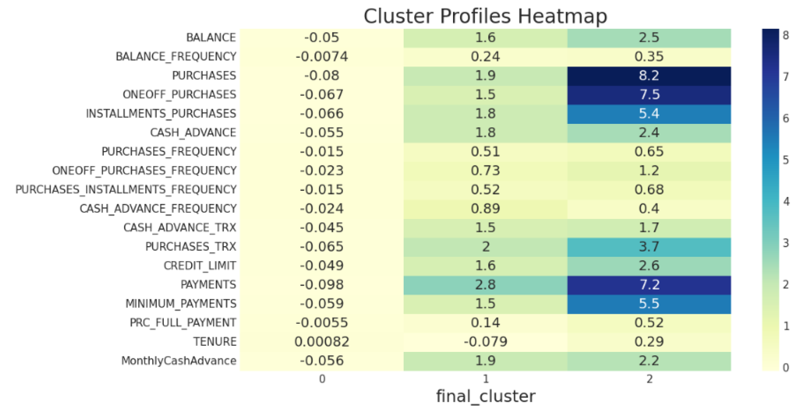

# Hybrid Market Segmentation with K‑Means, DBSCAN & GMM

**One‑line**: Robust, industry‑oriented customer segmentation using a hybrid of K‑Means, DBSCAN, and GMM with feature‑level fusion and a secondary K‑Means refiner.

> Based on the attached project report (Group 29) detailing EDA, individual clusterers, and a hybrid scheme leveraging voting and centroid‑distance features. 

## Why this project?
Traditional single‑algorithm clustering often struggles on high‑dimensional, noisy customer data. This repo packages a practical **hybrid clustering** workflow that:
- runs **K‑Means / DBSCAN / GMM**,
- **fuses** their signals via **majority vote** and **centroid‑distance features**, and
- applies a **secondary K‑Means** to produce **clean, actionable segments**.

## Highlights
- Clean, modular Python package (`src/`) and one‑command runner (`run.py`)
- Reproducible **EDA → Clustering → Hybrid Fusion → Profiling** pipeline
- Saved figures to `results/figs/` for easy README embedding
- Ready for further MLOps packaging (CLI, tests, CI, Docker), if you want to extend it

## Directory Structure
```
market-segmentation-hybrid-clustering/
├─ data/                           # Customer Segmentation data
├─ notebooks/                      
├─ results/
│  └─ figs/                        # auto-saved plots
├─ src/
│  ├─ __init__.py
│  ├─ data.py                      # loading + column lists
│  ├─ utils.py                     # standardize, z-score clip
│  ├─ eda.py                       # heatmaps etc.
│  ├─ viz.py                       # plotting helpers
│  └─ clustering/
│     ├─ kmeans.py                 # fit + metrics + elbow
│     ├─ dbscan.py                 # fit + metrics
│     ├─ gmm.py                    # fit + metrics
│     └─ hybrid.py                 # majority vote + distance features + secondary k-means
├─ run.py                          # quick entry point
├─ requirements.txt
└─ README.md
```

## Quickstart
```bash
# 1) Create & activate a virtual environment (optional but recommended)
python -m venv .venv && source .venv/bin/activate  # on Windows: .venv\Scripts\activate

# 2) Install dependencies
pip install -r requirements.txt

# 3) Add data
#   Put your CSV at: data/Customer_Data.csv  (columns match the report)

# 4) Run the end-to-end pipeline
python run.py
```

## Key Figures (auto-saved on first run)
<p align="center">
  
  
</p>
<p align="center">
  
  
</p>

## Method Summary
- **EDA**: correlations, distributions, sanity checks on missing values/outliers.
- **K‑Means**: hyperparameters (`n_init=10`, `max_iter=300`, `random_state=42`); elbow curve.
- **DBSCAN**: tuned `eps` & `min_samples`, resilient to noise/outliers.
- **GMM**: flexible cluster shapes (`covariance_type='full'`), supports overlap.
- **Hybrid Fusion**:
  1) **Majority vote** over K‑Means / DBSCAN / GMM labels (ignore DBSCAN noise where possible).
  2) **Centroid‑distance features**: min distance to K‑Means, GMM; min distance to DBSCAN cluster means (noise gets large value).
  3) **Secondary K‑Means** on these features → clean final segments.
- **Profiling**: heatmap of per‑cluster feature means for explainability.

## Results (from the report)
The attached report demonstrates clear **3‑segment structures** (low, moderate, and high spenders) and discusses quality metrics (Silhouette/Calinski‑Harabasz) and interpretability aids (PCA plots and profiles).

---

**Citation**: See the embedded Group 29 project report for background, EDA, and result discussion.
